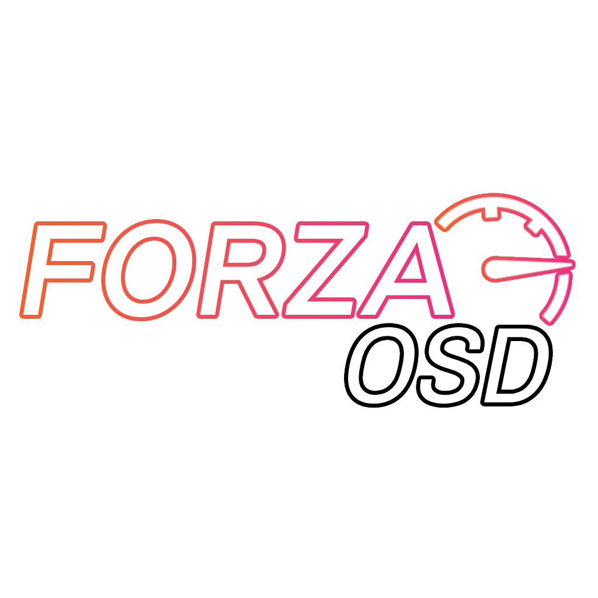

<p align="center">
  
</p>

# ForzaOSD

ForzaOSD is an external HUD overlay for Forza Horizon 6. It reads the game's telemetry stream over UDP and draws a transparent, click-through window over the game. It does not inject code, hook functions, or read game memory.

HUDs are Lua profiles. Each profile defines its layout, assets, fonts, settings, and optional custom DX11 pixel shaders. The app includes several recreations of existing racing HUDs, a separate VFD radio module, and a disabled shader demo module. Profiles reload when their Lua or shader files change.

## How it works

ForzaOSD listens for Forza telemetry packets on UDP port `5300` by default.

A `hud` profile provides the main speedometer. Any number of `module` profiles can run with it, including the VFD radio. Profile files contain the layout and configuration, so HUD changes do not require recompiling the application.

When a profile fails to reload, the diagnostics view reports the error and the current overlay keeps running. Release builds include the required runtime and do not require a separate .NET installation.

## Getting started

1. Extract the release archive and run `forzaosd.exe`.
2. In Forza, enable **Data Out** and set the address to `127.0.0.1` and the port to `5300`.
3. Press **Shift+Esc** to select and position a HUD, then save the settings.

## Building

Building requires Windows 10 or 11 and the .NET 10 SDK. A repository-local SDK is used when present.

```powershell
.\.dotnet\dotnet build ForzaOSD.slnx -c Release
.\.dotnet\dotnet test src\ForzaOSD.Tests\ForzaOSD.Tests.csproj -c Release
.\build.ps1
```

`build.ps1` writes a self-contained Windows x64 ZIP to `dist`.

See [Lua.md](Lua.md) for the HUD profile API and [credits.txt](credits.txt) for the projects whose HUD designs and assets were referenced.

## License

ForzaOSD is licensed under GPL-3.0. HUD assets remain the property of their respective creators.
